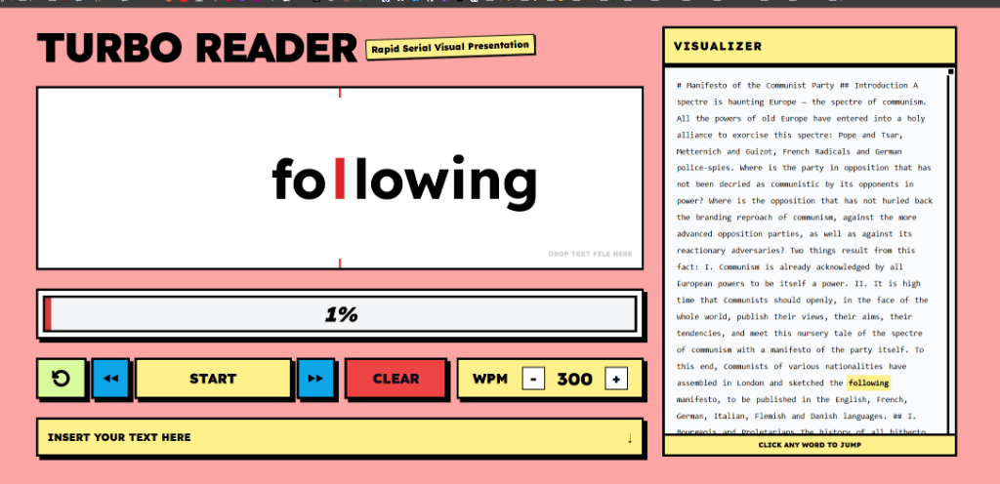

# Turbo Reader // RSVP Engine

A high-performance **Rapid Serial Visual Presentation (RSVP)** reader designed for speed and efficiency. Built with a bold **Neo-Brutalist** aesthetic.



## 🚀 Features

- **RSVP Reading Engine:** Blitz through text one word at a time with Optimal Recognition Point (ORP) highlighting.
- **Interactive Visualizer:** See the full context on the side. Click any word to jump exactly where you want to be.
- **Variable WPM:** Tune your speed from a comfortable 300 to a blistering 900+ WPM.
- **Drag & Drop:** Simply drop any `.txt` or `.md` file to start reading immediately.
- **Neo-Brutalist UI:** A heavy, high-contrast, and ultra-readable interface.
- **Responsive Design:** Works perfectly on desktop and tablet.

## 🛠️ Tech Stack

- **Vite** - Lightning fast build tool.
- **Tailwind CSS** - Modern utility-first styling.
- **PostCSS** - CSS processing.
- **Vanilla JS** - Clean, performant logic.

## 🏁 Getting Started

1. **Clone the repo:**
   ```bash
   git clone https://github.com/PhilippeHo27/TurboReader.git
   ```
2. **Install dependencies:**
   ```bash
   npm install
   ```
3. **Run locally:**
   ```bash
   npm run dev
   ```

## 📜 License

Created by **Antigravity**. Use it to read faster, learn more, and seize the means of information.
